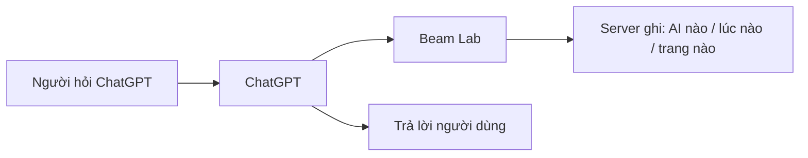
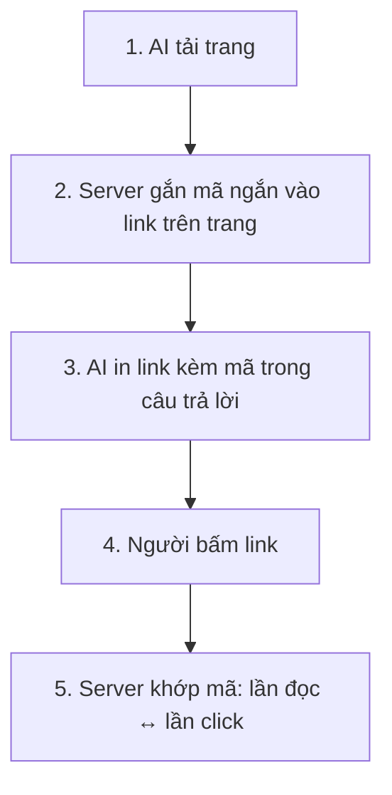
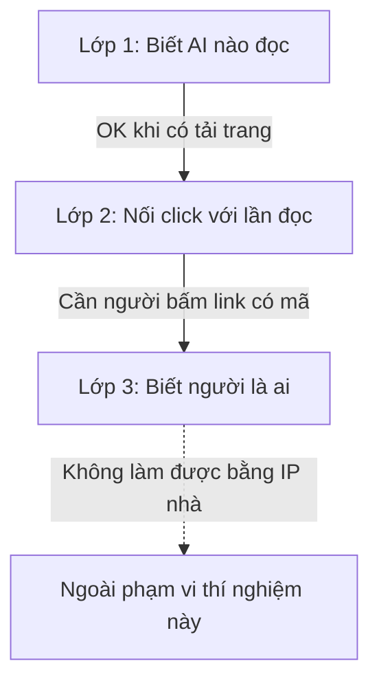
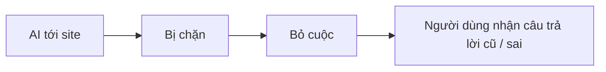
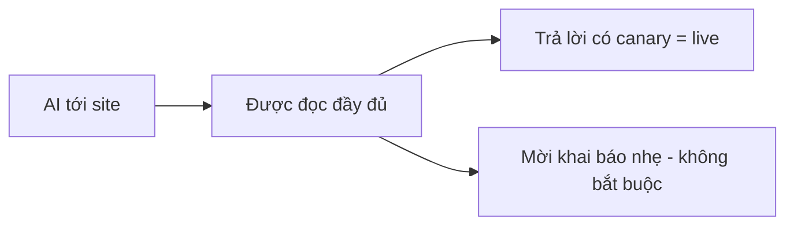
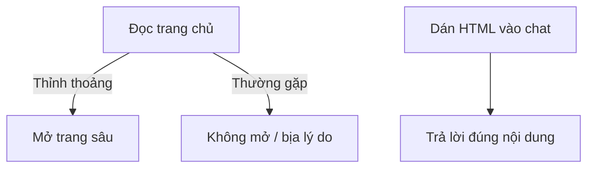

# Beam Lab — Brief trình bày team

Cập nhật: 2026-08-01 · Dùng để thảo luận (ít thuật ngữ)  
Chi tiết kỹ thuật: [beam-lab-resume.md](./beam-lab-resume.md)

---

## 1. Mục tiêu thí nghiệm (1 câu)

**Biết khi nào AI đang đọc site của mình, và khi người thật bấm link từ câu trả lời AI thì nối được hai sự kiện đó.**

Site thử: [beamlab.nhantown.com](https://beamlab.nhantown.com/)

---

## 2. Ba câu hỏi sản phẩm — trả lời tới đâu?

| Câu hỏi | Kết quả | Giải thích ngắn |
|---------|---------|-----------------|
| AI nào đang đọc? | **Được** | Khi AI thật sự tải trang, server ghi nhận + nhận diện được |
| Người bấm link có khớp với lần AI đọc không? | **Cơ chế có / chưa chứng minh đủ** | Đã gắn mã trên link; còn thiếu lần người thật bấm để chốt |
| Người đó là ai (tên/email)? | **Chưa** | IP nhà / Wi‑Fi không đủ định danh cá nhân |

---

## 3. Luồng cơ bản (để thảo luận)

### A. AI đọc trang

**Điều kiện:** AI phải **thật sự tải** trang. Không tải → không có bằng chứng trên server.

### B. Nối “AI đọc” với “người bấm”

Hai loại mã (đừng lẫn khi nói với eng):

| Tên gọi dễ hiểu | Mã | Việc gì |
|-----------------|-----|---------|
| Mã từ cổng sản phẩm (offers) | `_bam` | Đã chứng minh với ChatGPT thật |
| Mã từ trang lab (edge) | `_bfm` | Cơ chế sẵn; **chưa** có lần người bấm đủ để đóng case |

### C. Ba lớp “biết được gì”

---

## 4. Thử gì → hỏng gì → được gì

### Lần 1 — Chặn cứng (403)

| | |
|--|--|
| Ý tưởng | Nghi AI → chặn trang, bắt khai báo rồi mới đọc |
| Thực tế | ChatGPT bỏ cuộc, trả lời kiểu cache / sai |
| Kết luận | **Chặn cứng = chỉ đo được “AI bỏ cuộc”, không đo hành vi thật** |

### Lần 2 — Soft-serve (đang dùng)

| | |
|--|--|
| Ý tưởng | Luôn cho đọc nội dung; hỏi nhẹ bên trong (không chặn) |
| Thực tế | ChatGPT đọc được trang live |
| Dấu hiệu live | Chuỗi canary **`FUCHSIA-0731`** trên trang chủ — AI nhắc đúng = đang đọc bản thật |

### Lần 3 — Nhảy sang trang sâu

| | |
|--|--|
| Ý tưởng | AI đọc trang chủ → tự mở trang “danh sách tác nhân” |
| Thực tế | **Không ổn định**: lúc có, lúc không |
| Khi fail | Đôi khi bịa lý do (“trang JS”, nhầm sang site khác) dù trang công khai |
| Khi paste nội dung vào chat | Liệt kê token **đúng hết** → hiểu chữ OK, **đi lấy trang** mới là phần yếu |

### Lần 4 — Gemini (ghi chú nhanh)

Một lần tải trông giống Gemini nhưng “mặt nạ” không giống bot Google quen thuộc → hệ thống **chưa** ghi là AI. Gap sản phẩm nếu muốn theo dõi Gemini kiểu này.

---

## 5. Quyết định đã chốt (team nhớ 4 ý)

1. **Không chặn cứng** AI đọc nội dung trên lab (soft-serve).
2. **Có tải trang mới tin** — câu trả lời AI không có bằng chứng server ≠ đã đọc live (dùng canary để kiểm).
3. **IP không dùng làm chìa khóa phiên** — IP đổi giữa các lần tải trong cùng một câu trả lời.
4. **Không hứa** “ChatGPT luôn follow link trang sâu” — đó là giới hạn công cụ browse của họ, không phải bug trang lab.

---

## 6. Việc còn lại (ưu tiên thảo luận)

| # | Việc | Vì sao quan trọng |
|---|------|-------------------|
| 1 | Người thật bấm link có mã `_bfm` | Chốt lớp 2 (click ↔ lần đọc) |
| 2 | Đưa thay đổi DB lên môi trường prod API | Lab local đã có; prod chưa |
| 3 | (Tuỳ) Nhận diện thêm kiểu tải “mặt nạ lạ” như Gemini | Tránh bỏ sót |
| 4 | Thử thêm Claude / Perplexity | Biết hành vi có giống ChatGPT không |
| 5 | Tắt log đầy đủ sau cửa sổ debug | Tránh ghi thừa traffic người thường |

---

## 7. Câu hỏi gợi ý khi thảo luận team

1. Lớp 1 (biết AI nào) có đủ cho MVP marketing / sales không, hay bắt buộc cần lớp 2 (click)?
2. Có chấp nhận “AI không luôn mở trang sâu” như giới hạn sản phẩm không?
3. Có đầu tư nhận diện Gemini kiểu “mặt nạ lạ” ngay không?
4. Ai chịu trách nhiệm lần proof “người bấm link có mã”?

---

## Tài liệu liên quan

| Doc | Khi nào đọc |
|-----|-------------|
| [beam-lab-resume.md](./beam-lab-resume.md) | Eng / resume kỹ thuật |
| [agent-detection-architecture.md](./agent-detection-architecture.md) §5d | Chi tiết kiến trúc |
| [journals/260801-0051-…](./journals/260801-0051-beam-lab-soft-serve-bfm.md) | Nhật ký phiên |
