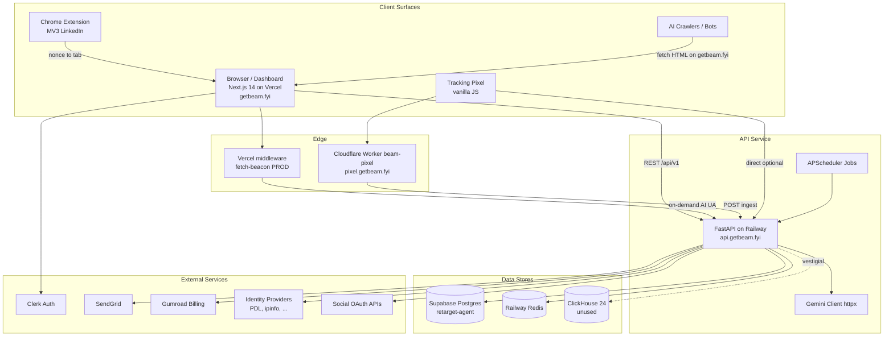
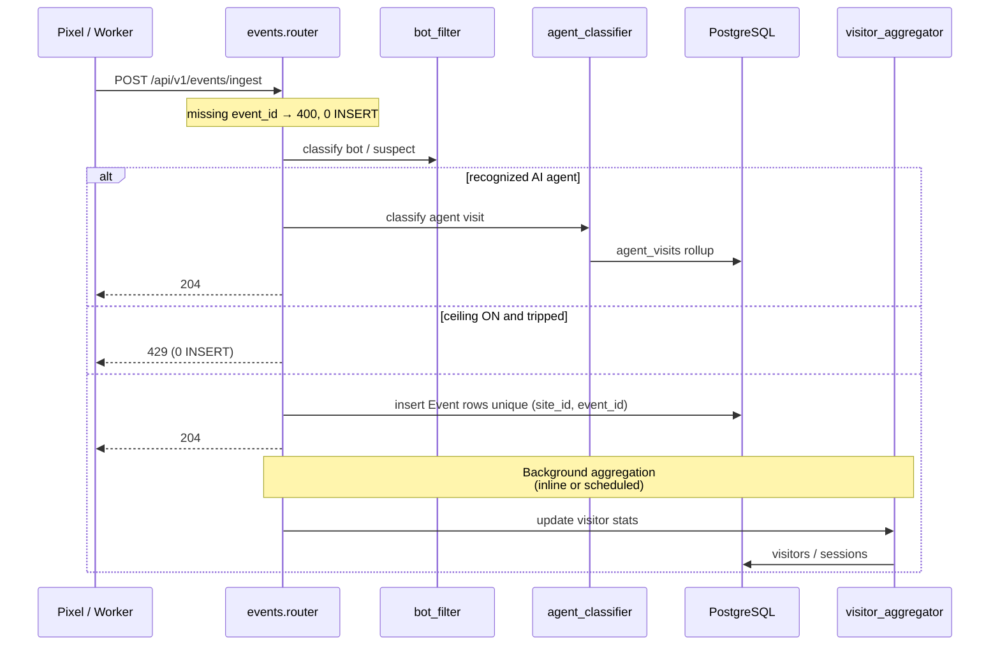
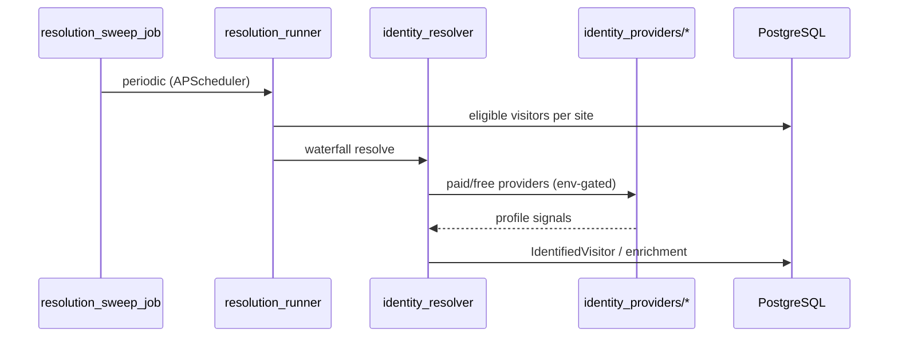
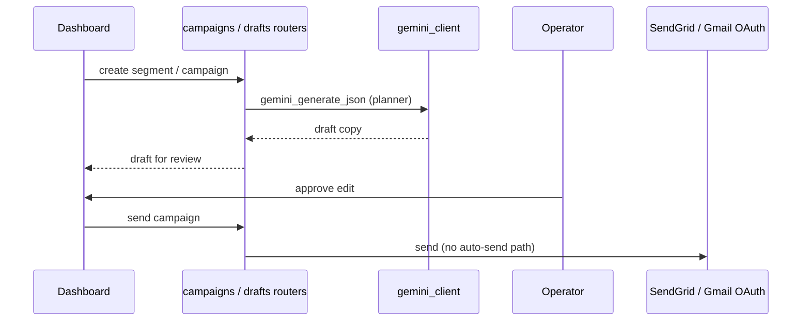
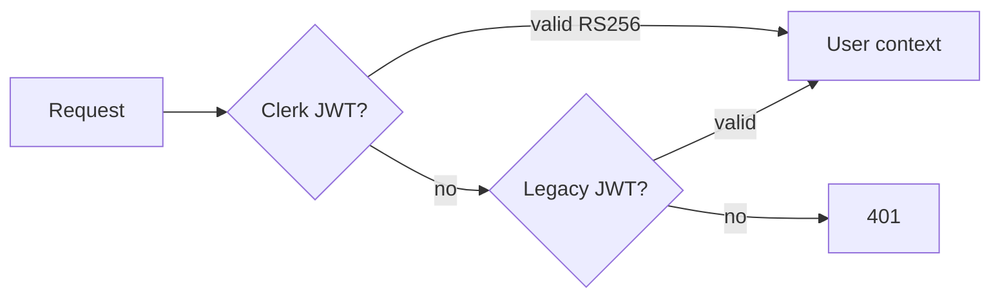

# System Architecture

Last updated: 2026-08-18

## Overview

Beam is a **monolithic FastAPI backend** with a **Next.js dashboard**, **edge-delivered pixel**, and optional **Chrome extension**. PostgreSQL is the system of record; Redis supports cache, rate limits, visitor-aggregation mutex keys, and a dormant Celery broker.

**GetBeam PROD hosting (live 2026-08-18):** Next.js on **Vercel** (`getbeam.fyi`), FastAPI on **Railway** (`api.getbeam.fyi`), Postgres on **Supabase** `retarget-agent`. Cloudflare in front of `getbeam.fyi` is DNS/WAF only. Pixel CDN is Worker `beam-pixel` → `pixel.getbeam.fyi`. Lab hosts (`splittrip.nhantown.com`, `beamlab.nhantown.com`) are **not** GetBeam PROD.

Publish-grade diagram: [visuals/beam-system-architecture.svg](./visuals/beam-system-architecture.svg) ([PNG](./visuals/beam-system-architecture.png)). Env promotion: [local-uat-prod.md](./local-uat-prod.md).

## Component Diagram

## Request Flow: Event Ingest

**Key files:** `routers/events.py`, `schemas/events.py`, `services/bot_filter.py`, `services/agent_classifier.py`, `services/ip_resolution.py`, `services/rate_limiter.py`, `models/event.py`, `models/database.py`, `services/visitor_aggregator.py`, `services/aggregation_debounce.py`

**Ingest contract (HEAD `73142d1`; flags still OFF):** missing/empty `event_id` → **400**, 0 INSERT. Unique `(site_id, event_id)` with `ON CONFLICT DO NOTHING`. `Event.created_at = datetime.utcnow()` — never client `event.ts`. Site ceiling (`site_ingest_limit_enabled`, default **False**, number **155**) → **429**, 0 INSERT. `CF-Connecting-IP` is honoured only when the TCP peer is in bundled Cloudflare CIDRs (`ingest_trust_cf_connecting_ip` default True). Request sessions apply `SET LOCAL statement_timeout` from `db_statement_timeout_ms` (default **0** = off); sweep / retention / ingest-agg / F9 bootstrap override with `SET LOCAL 0`.

**Visitor aggregation (P1 code; flag still OFF):** Redis `agg:debounce:{site_id}` is a mutex held until `finally` (holder token + TTL refresh); leftover cooldown is the remainder of `aggregation_min_interval_seconds` (default 60). Flag ON + Redis down → ingest skips aggregation (same as the sweep). A full ingest run (`since=None`) stamps `sites.last_aggregated_at`; the periodic sweep does not. `run_aggregation_watermark_bootstrap()` is operator-invoked and is **not** registered in `start_scheduler`. Operator order (migrate-then-deploy, F9+soak, then flags): [deployment-guide.md §Scale-ready](./deployment-guide.md#scale-ready-x20x30).

## Request Flow: Identity Resolution

**Scheduler:** `jobs/scheduler.py` → `services/resolution_runner.py`

**Resolution Queue Order (7b1ed33):** Eligible visitors ranked `ai_attributable_human.desc()` (has `ai_source` OR same-site `AgentHandoffLink`) THEN `intent_score.desc()`. AI-attributed visitors resolve first within monthly/daily budget.

## Request Flow: Campaign Draft → Human Send

**Stance:** no API path sends outreach without explicit operator action.

## Dashboard Architecture (`apps/web`)

| Layer | Technology |
|-------|------------|
| Framework | Next.js 14 App Router |
| Auth | Clerk + legacy JWT via `api.ts` |
| Styling | Tailwind 3.4 + shadcn/ui |
| Marketing | Static assets `public/beam/` + some React routes |
| Data fetching | `api.ts` singleton, TanStack Query in places |

**Major route groups:**

| Prefix | Product label | Backend domains |
|--------|---------------|-----------------|
| `/dashboard` | EasyTrack home | `dashboard`, `visitors`, `sites` |
| `/dashboard/visitors` | Visitors | `visitors`, identity |
| `/dashboard/agents` | EvalLayer | `agents` |
| `/dashboard/campaigns` | Campaigns | `campaigns`, `outcomes` |
| `/dashboard/feed`, `/drafts` | EasyEngage | `feed`, `drafts`, `social` |
| `/dashboard/connectors` | CRM / Ads | `crm`, `ads` |

## API Surface (router map)

Registered in `apps/api/main.py` (prefix `/api/v1` unless noted):

| Tag / area | Prefix | Purpose |
|------------|--------|---------|
| auth | `/auth` | JWT signup/login, Clerk bridge |
| events | `/events` | Ingest, pixel health |
| sites | `/sites` | Site CRUD, pixel config |
| visitors | `/visitors` | Visitor CRUD, enrichment |
| agents | `/agents` | EvalLayer analytics |
| segments | `/segments` | Segment CRUD + AI |
| campaigns | `/campaigns` | Campaign lifecycle |
| drafts / feed | `/drafts`, `/feed` | EasyEngage |
| billing | `/billing` | Gumroad + legacy Stripe |
| ads | `/ads` | Ad audience push |
| crm | `/crm` | CRM connectors |
| ai | `/ai` | Ask / assistant |
| webhooks | various | Gumroad, SendGrid, Stripe |
| click / open-pixel | `/c`, `/o` | Tracking pixels |

## Background Jobs (live)

APScheduler in `jobs/scheduler.py` (representative):

| Job | Purpose |
|-----|---------|
| `_sync_job` | Social account feed sync |
| `_resolution_sweep_job` | Identity resolution sweep |
| `_aggregation_sweep_job` | Full-recompute repair (does **not** stamp `last_aggregated_at`) |
| `_retention_purge_job` | Old events / fetch events purge |
| Digest / nudge jobs | Gated by feature flags (default OFF) |

`run_aggregation_watermark_bootstrap()` exists for operator sequential full+stamp; it is **not** an APScheduler job.

Celery tasks in `tasks/` exist but are **not consumed** unless `celery_worker_enabled=true` and a worker process is deployed.

## Data Model (high level)

| Store | Tables / usage |
|-------|----------------|
| PostgreSQL | `events` (unique `(site_id, event_id)` after Alembic `c3f6a9d1e8b2`), `visitors`, `identified_visitors`, `campaigns`, `segments`, `agent_visits`, `posts`, `drafts`, billing, CRM, ads, etc. |
| Redis | Rate limits, cache keys, `agg:debounce:{site_id}` mutex, Celery broker DB 1/2 (idle) |
| ClickHouse | Schema init code exists; **zero runtime callers** |

## AI Integration

| Provider | Role |
|----------|------|
| Google Gemini 2.5 Flash | Primary: segmentation, planning, `/ai/ask` |
| OpenRouter | Fallback for social reply drafts |
| Anthropic | Legacy demo fallback only (`routers/demo.py`) |

Client: `services/gemini_client.py` (httpx REST, not SDK).

## Auth Model

## Feature Flags

Most new capabilities default **OFF** in `config.py`. Examples:

- `agent_detection_enabled`
- `ad_audiences_enabled`
- `cadence_bot_flag_enabled`
- `company_graph_enabled`, `identity_signals_enabled`
- `celery_worker_enabled`
- `aggregation_incremental_enabled` (default **False**; code path exists, prod flag not flipped)
- `site_ingest_limit_enabled` (default **False**; ceiling number **155**)
- `db_statement_timeout_ms` (default **0** = disabled)

Operators must apply pending Alembic migrations before enabling flags in production. Scale-ready operator order: [deployment-guide.md §Scale-ready](./deployment-guide.md#scale-ready-x20x30).

## GetBeam PROD vs lab hosts

| Host | Role |
|------|------|
| `getbeam.fyi` | GetBeam PROD web (Vercel). Fetch-beacon = this app's middleware. |
| `api.getbeam.fyi` | GetBeam PROD API (Railway). |
| `pixel.getbeam.fyi` | Pixel CDN (CF Worker `beam-pixel`). |
| `splittrip.nhantown.com` | **Lab** customer site. Worker `beam-agent-beacon-splittrip` → `beam-api.nhantown.com`. |
| `beamlab.nhantown.com` | **Lab** Cloudflare Pages experiment (local DB, not prod). |
| `beam-api.nhantown.com` | Named-tunnel / laptop API — not Railway prod. |

## Beam Lab (Edge Experiment Surface)

`infra/cloudflare/beam-lab/` is a standalone Cloudflare Pages deployment (`beamlab.nhantown.com`),
separate from the `client` → `edge` → `api` flow above: it is Beam's own static site, run purely to
validate the AI-agent detection chain end-to-end, and it writes to a local dev Postgres rather than
production. Its Pages Functions middleware performs, at the edge, what the API otherwise infers
from a beacon: it classifies on-demand AI User-Agents, soft-serves them full HTML with an embedded
identification invitation (replacing an earlier hard-403 gate that real ChatGPT-User simply gave up
on), and stamps an opaque `?_bfm=` marker onto same-host links — a sibling of the API's own
Fernet-encrypted `?_bam=` marker (§ EvalLayer above), joined via new `agent_fetch_events.link_marker`
/ `events.link_marker` columns. See [agent-detection-architecture.md §5d](./agent-detection-architecture.md#5d-soft-serve-gate--marker-biên-_bfm-trên-beam-lab-31-07--01-08)
and [beam-lab-resume.md](./beam-lab-resume.md) for detail and open items.

## Drift vs Early Docs

| Early architecture doc | Current |
|--------------------------|---------|
| ClickHouse event pipeline | Postgres `events` table |
| Celery worker pool | APScheduler in uvicorn process |
| Claude segmentation | Gemini client |
| Auto campaigns | Human-in-the-loop only |
| getbeam.fyi on Cloudflare Pages | **Vercel** origin; Cloudflare is DNS/WAF |
| `beam-agent-beacon-splittrip` = GetBeam PROD | **Lab only** (`splittrip.nhantown.com`) |

## References

- [codebase-summary.md](./codebase-summary.md)
- [deployment-guide.md](./deployment-guide.md)
- [agent-detection-architecture.md](./agent-detection-architecture.md) — EvalLayer + Beam Lab detail
- [beam-lab-resume.md](./beam-lab-resume.md)
- `apps/api/main.py` — router registry
- `process/context/all-context.md` — EvalLayer, ingest hardening detail
