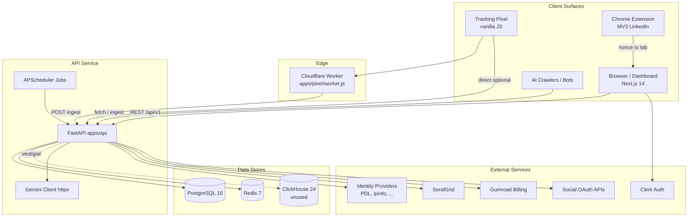
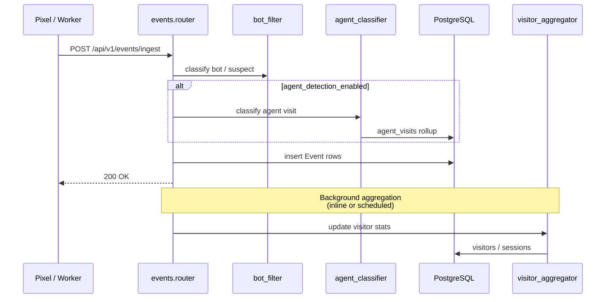
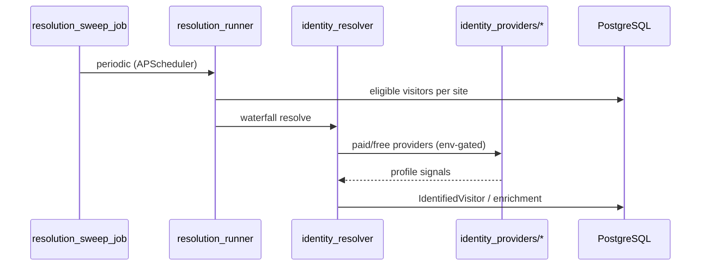
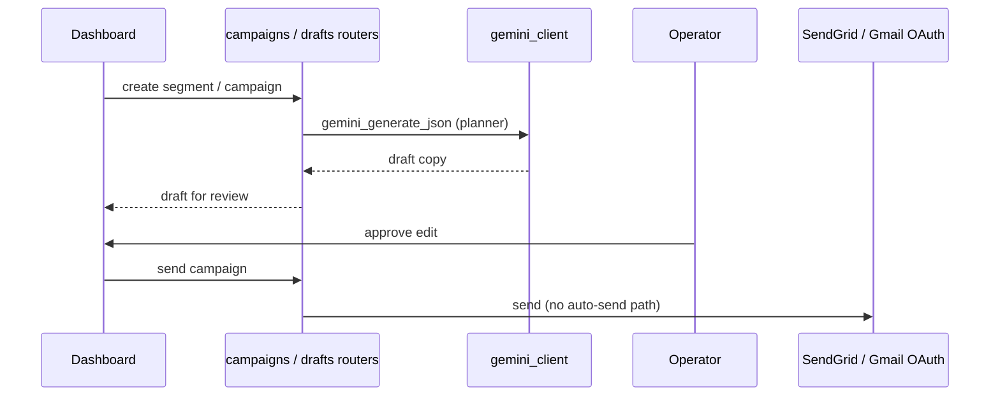
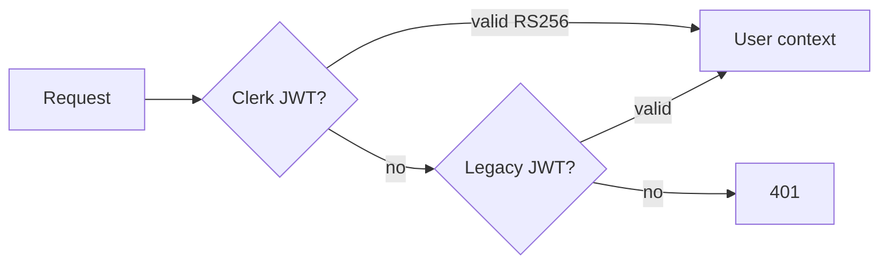

# System Architecture

Last updated: 2026-07-28

## Overview

Beam is a **monolithic FastAPI backend** with a **Next.js dashboard**, **edge-delivered pixel**, and optional **Chrome extension**. PostgreSQL is the system of record; Redis supports cache, rate limits, and a dormant Celery broker.

Publish-grade diagram: [visuals/beam-system-architecture.svg](./visuals/beam-system-architecture.svg) ([PNG](./visuals/beam-system-architecture.png)). Env promotion: [local-uat-prod.md](./local-uat-prod.md).

## Component Diagram

## Request Flow: Event Ingest

**Key files:** `routers/events.py`, `services/bot_filter.py`, `services/agent_classifier.py`, `models/event.py`

## Request Flow: Identity Resolution

**Scheduler:** `jobs/scheduler.py` → `services/resolution_runner.py`

**Resolution Queue Order (7b1ed33):** Eligible visitors ranked `ai_attributable_human.desc()` (has `ai_source` OR same-site `AgentHandoffLink`) THEN `intent_score.desc()`. AI-attributed visitors resolve first within monthly/daily budget.

## Request Flow: Campaign Draft → Human Send

**Stance:** no API path sends outreach without explicit operator action.

## Dashboard Architecture (`apps/web`)

| Layer | Technology |
|-------|------------|
| Framework | Next.js 14 App Router |
| Auth | Clerk + legacy JWT via `api.ts` |
| Styling | Tailwind 3.4 + shadcn/ui |
| Marketing | Static assets `public/beam/` + some React routes |
| Data fetching | `api.ts` singleton, TanStack Query in places |

**Major route groups:**

| Prefix | Product label | Backend domains |
|--------|---------------|-----------------|
| `/dashboard` | EasyTrack home | `dashboard`, `visitors`, `sites` |
| `/dashboard/visitors` | Visitors | `visitors`, identity |
| `/dashboard/agents` | EvalLayer | `agents` |
| `/dashboard/campaigns` | Campaigns | `campaigns`, `outcomes` |
| `/dashboard/feed`, `/drafts` | EasyEngage | `feed`, `drafts`, `social` |
| `/dashboard/connectors` | CRM / Ads | `crm`, `ads` |

## API Surface (router map)

Registered in `apps/api/main.py` (prefix `/api/v1` unless noted):

| Tag / area | Prefix | Purpose |
|------------|--------|---------|
| auth | `/auth` | JWT signup/login, Clerk bridge |
| events | `/events` | Ingest, pixel health |
| sites | `/sites` | Site CRUD, pixel config |
| visitors | `/visitors` | Visitor CRUD, enrichment |
| agents | `/agents` | EvalLayer analytics |
| segments | `/segments` | Segment CRUD + AI |
| campaigns | `/campaigns` | Campaign lifecycle |
| drafts / feed | `/drafts`, `/feed` | EasyEngage |
| billing | `/billing` | Gumroad + legacy Stripe |
| ads | `/ads` | Ad audience push |
| crm | `/crm` | CRM connectors |
| ai | `/ai` | Ask / assistant |
| webhooks | various | Gumroad, SendGrid, Stripe |
| click / open-pixel | `/c`, `/o` | Tracking pixels |

## Background Jobs (live)

APScheduler in `jobs/scheduler.py` (representative):

| Job | Purpose |
|-----|---------|
| `_sync_job` | Social account feed sync |
| `_resolution_sweep_job` | Identity resolution sweep |
| `_retention_purge_job` | Old events / fetch events purge |
| Digest / nudge jobs | Gated by feature flags (default OFF) |

Celery tasks in `tasks/` exist but are **not consumed** unless `celery_worker_enabled=true` and a worker process is deployed.

## Data Model (high level)

| Store | Tables / usage |
|-------|----------------|
| PostgreSQL | `events`, `visitors`, `identified_visitors`, `campaigns`, `segments`, `agent_visits`, `posts`, `drafts`, billing, CRM, ads, etc. |
| Redis | Rate limits, cache keys, Celery broker DB 1/2 (idle) |
| ClickHouse | Schema init code exists; **zero runtime callers** |

## AI Integration

| Provider | Role |
|----------|------|
| Google Gemini 2.5 Flash | Primary: segmentation, planning, `/ai/ask` |
| OpenRouter | Fallback for social reply drafts |
| Anthropic | Legacy demo fallback only (`routers/demo.py`) |

Client: `services/gemini_client.py` (httpx REST, not SDK).

## Auth Model

## Feature Flags

Most new capabilities default **OFF** in `config.py`. Examples:

- `agent_detection_enabled`
- `ad_audiences_enabled`
- `cadence_bot_flag_enabled`
- `company_graph_enabled`, `identity_signals_enabled`
- `celery_worker_enabled`

Operators must apply pending Alembic migrations before enabling flags in production.

## Drift vs Early Docs

| Early architecture doc | Current |
|--------------------------|---------|
| ClickHouse event pipeline | Postgres `events` table |
| Celery worker pool | APScheduler in uvicorn process |
| Claude segmentation | Gemini client |
| Auto campaigns | Human-in-the-loop only |

## References

- [codebase-summary.md](./codebase-summary.md)
- [deployment-guide.md](./deployment-guide.md)
- `apps/api/main.py` — router registry
- `process/context/all-context.md` — EvalLayer, ingest hardening detail
