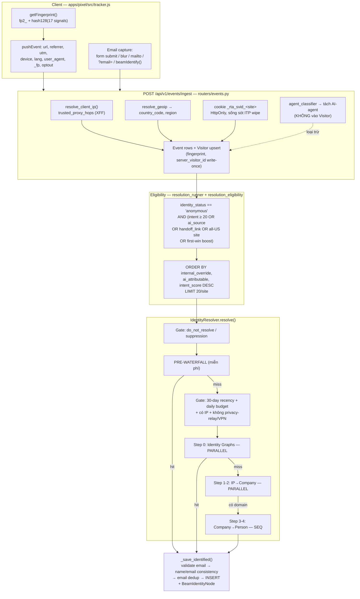
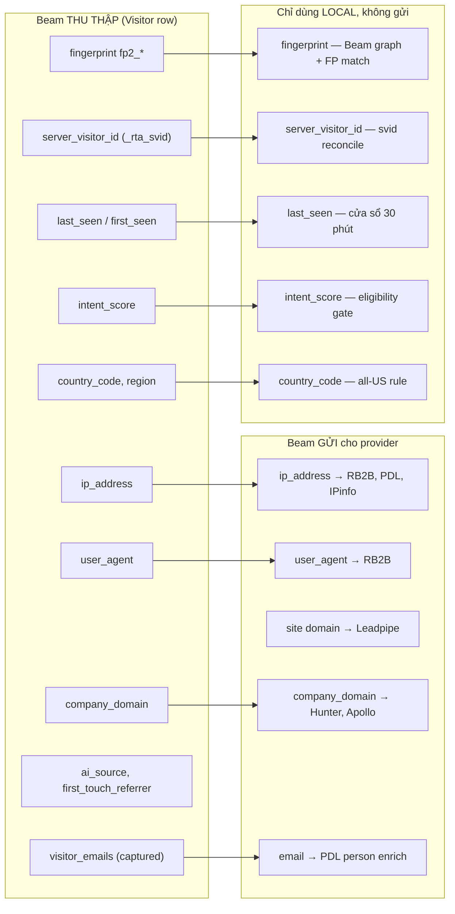
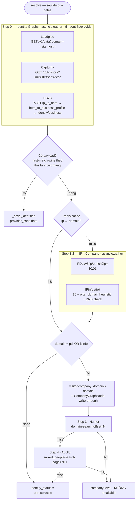

# Visitor Identity Resolution — Kiến trúc luồng & Input Providers

Last updated: 2026-08-05 · Branch: `dev_nhantc2` · So sánh với `origin/main-backup1_8`

Tài liệu hệ thống hoá luồng định danh khách hàng (visitor → identity), tập trung vào
**dữ liệu đầu vào (input) gửi cho từng provider** — vì đó là chỗ đang muốn tối ưu.
Mục tiêu hiện tại: **giữ nguyên hành vi waterfall**, chỉ chỉnh input để hiệu quả hơn.

⚠️ **Đọc trước:** [identity-us-current-handoff.md](./identity-us-current-handoff.md) — trạng thái
live và các blocker đang chặn (Leadpipe account expired, 2 plan Phase 2 cạnh tranh). File này
mô tả *kiến trúc*; file kia mô tả *cái gì đang chặn ngay lúc này*.

Xem thêm: `docs/agent-detection-architecture.md` (AI-agent traffic, tách biệt hoàn toàn),
`process/features/visitors-identity/_GUIDE.md`.

---

## TL;DR (đọc cái này trước)

| # | Phát hiện | Mức độ |
|---|---|---|
| 1 | **Capturify không được scope theo site** — chỉ lấy `limit=10, sort=desc` account-wide rồi match IP local. Site traffic thấp gần như không bao giờ khớp. | 🔴 Cao |
| 2 | **Leadpipe/Capturify là PULL feed, không phải lookup** — Beam không gửi IP/visitor lên, mà tải feed về rồi tự lọc `IP == visitor.ip AND |Δt| ≤ 30 phút`. Không có filter per-IP ở API. | 🔴 Cao |
| 3 | **RB2B là provider duy nhất thực sự "gửi input"** — chỉ 2 trường: `ip_address` + `user_agent`. Fingerprint/cookie Beam KHÔNG BAO GIỜ được gửi đi. | 🟡 Trung bình |
| 4 | Record không có timestamp → **bị từ chối thẳng** (`matching.py:103-115`). Nếu Leadpipe/Capturify trả feed thiếu field timestamp đã map, tỉ lệ match = 0. | 🔴 Cao |
| 5 | IPinfo free-tier suy đoán domain kiểu `"Acme Corp"` → `acmecorp.com` rồi check DNS. Nguồn nhiễu chính cho Hunter/Apollo phía sau. | 🟡 Trung bình |
| 6 | Hunter/Apollo trả **nhân viên bất kỳ** của công ty, không phải người truy cập → gắn nhãn `company-level`, không emailable. | ℹ️ Theo thiết kế |

| 7 | **Leadpipe/Capturify chỉ hoạt động khi pixel CỦA HỌ được cài lên site khách.** Beam có sẵn cơ chế (`data-stack`) nhưng snippet cũ không tự cập nhật, và pixel-id theo site là code chết. Chi tiết §6 | 🔴 Cao — gốc rễ |
| 8 | **Leadpipe có webhook push, Beam đang polling.** Webhook xoá bỏ cùng lúc vấn đề #1, #2, #4. Đã nằm trong Phase 2 của plan active | 🔴 Cao — hướng đi |

**Kết luận cho mục tiêu "chỉnh input lúc đầu"**: đòn bẩy lớn nhất KHÔNG nằm ở việc
thêm trường vào payload provider (RB2B chỉ nhận IP+UA; Leadpipe/Capturify không nhận
gì cả). Xếp theo thứ tự thực tế:

1. **Đảm bảo pixel vendor thực sự nạp trên site khách** (§6.3) — không có bước này thì
   mọi thứ khác vô nghĩa.
2. **Chuyển từ pull sang webhook** (§6.4) — bỏ luôn phần đoán IP + cửa sổ 30 phút.
3. Mở rộng first-party signal (email capture / svid) để không cần provider trả phí.
4. Chỉ khi vẫn dùng pull: scope query + counter ở `matching.py` (§5).

---

## 1. Luồng tổng thể



---

## 2. Câu hỏi 1 — Input fields gửi cho từng provider

### 2.1 Bảng tổng hợp (điểm cốt lõi)

| Provider | Kiểu gọi | **Input Beam thực sự gửi** | Match logic | Cost | Confidence |
|---|---|---|---|---|---|
| **Leadpipe** | `GET /v1/data` (pull feed) | `domain` = hostname của site **(chỉ vậy)** | Local: `record.ip == visitor.ip` **AND** `|Δt| ≤ 30min` | $0 | 0.95 |
| **Capturify** | `GET /v1/visitors` (pull feed) | `limit=10`, `sort=desc` — **KHÔNG có site scope** | Local: giống trên | $0 | 0.90 |
| **RB2B** | `POST` chain 3 bước | `ip_address`, `user_agent`, `include_sha256` | Server-side (RB2B graph) | $0.09 | score từ RB2B (0-0.99) |
| **PDL IP** | `GET /v5/ip/enrich` | `ip` | Server-side | $0.01 | — (trả domain) |
| **IPinfo** | `GET /{ip}` | `ip` (path), `token` | Server-side + heuristic local | $0 | — (trả domain) |
| **Hunter** | `GET /v2/domain-search` | `domain`, `limit=5`, `offset=N` | — | $0 | `confidence/100` |
| **Apollo** | `POST /mixed_people/search` | `q_organization_domains`, `per_page=1`, `page=N+1` | — | $0 | 0.6 |
| **PDL person** | `GET /v5/person/enrich` | `email` (đã captured) | — | $0.01 | 0.90 |

> `offset` của Hunter/Apollo = `_count_identified_for_domain()` — số IdentifiedVisitor đã có
> cho domain đó, để mỗi visitor cùng công ty nhận contact khác nhau (tránh trùng lặp).

### 2.2 Trường dữ liệu Beam THU THẬP vs Beam GỬI ĐI

Đây là điểm quan trọng nhất cho việc "tối ưu input":



**Nhận xét**: chỉ **5 trường** rời khỏi hệ thống. `fingerprint`, `server_visitor_id`,
`last_seen` — 3 tín hiệu mạnh nhất Beam có — đều **không được gửi cho bất kỳ provider nào**
(đúng chủ ý về privacy, xem docstring RB2B: *"Beam cookie/fp2_* are never sent"*).

### 2.3 Fingerprint gồm 17 tín hiệu (`tracker.js:127-147`)

`screen.width×height` · `availWidth×availHeight` · `colorDepth` · `devicePixelRatio` ·
`language` · `platform` · `hardwareConcurrency` · `deviceMemory` · `maxTouchPoints` ·
`cookieEnabled` · `doNotTrack` · `pdfViewerEnabled` · `Intl timeZone` ·
`connection.effectiveType` · `canvasFp()` (canvas 200×50, lấy 50 ký tự cuối dataURL) ·
`webglFp()` (vendor~renderer~MAX_TEXTURE_SIZE) · `Math.tan(-1e300)` → `fp2_<hash128>`

---

## 3. Câu hỏi 2 — Luồng provider hiện tại hoạt động ra sao

### 3.1 Pre-waterfall (miễn phí, chạy TRƯỚC mọi gate trả phí)

Chạy theo đúng thứ tự, dừng ở hit đầu tiên. `identity_resolver.py:229-395`.

| Thứ tự | Check | Nguồn | Confidence | Emailable |
|---|---|---|---|---|
| 0 | `svid_reconcile` — cookie `_rta_svid` trỏ về visitor cũ đã định danh | Deterministic | 0.90 | ✅ |
| 1 | `form_capture` — email đã capture (theo `visitor_id` HOẶC `svid`) | Deterministic | 0.80 / 0.85 nếu graph có tên | ✅ |
| 1b | `pdl_person_enrich` — chỉ khi `enrich_captured_email_pdl=True` (**mặc định OFF**) | PDL, $0.01 | 0.90 | ✅ |
| 2 | `fingerprint_match` — visitor khác cùng fingerprint đã định danh | Probabilistic | 0.75 | ✅ |
| 3 | `beam_identity_network` — cross-tenant graph theo fingerprint | Probabilistic | 0.85 | ✅ |

Mỗi bước đều re-check suppression `do_not_process` để không copy lại identity đã opt-out.

### 3.2 Waterfall trả phí



**Chi tiết cần biết:**

- **First-match-wins theo index mảng**, không theo thời gian trả về. Thứ tự cứng:
  `leadpipe → capturify → rb2b` ([identity_resolver.py:596-600](apps/api/services/identity_resolver.py#L596-L600)).
- **Ledger được hoãn ghi** cho payload thắng cho đến sau `_save_identified` — nếu bị
  reject do name↔email mismatch thì không ghi `success=True` (cải tiến so với backup).
- **Redis cache** `ip → domain`, TTL `RESOLUTION_CACHE_TTL`; cache cả miss (`__none__`, 24h).
- **RB2B chain 3 bước**: `ip_to_hem` (chọn `max(score)`) → `hem_to_business_profile`
  (thường trả MD5 chứ không phải email thật) → `identity/business` (chỉ khi có `md5`,
  lấy `work_email_confirmed` dạng plaintext).

### 3.3 Cơ chế match local của Leadpipe/Capturify (`matching.py`)

Đây là chỗ dễ mất match nhất:

```
record_ts = parse(record[timestamp|capturedAt|createdAt|identifiedAt|lastSeen|seenAt|visitedAt|date])

if record_ts is None          → (False, False)   ← TỪ CHỐI THẲNG, kể cả IP khớp
if |record_ts - visitor.last_seen| > 30 phút → (False, False)
else                          → (True, False)    ← match mạnh
```

IP khớp **một mình là không đủ** — lý do: feed là account-wide, IP văn phòng/CGNAT chia sẻ
cho nhiều người. Quyết định này đúng về mặt an toàn, nhưng nó biến **field-name mapping của
timestamp** thành điểm chết: provider dùng tên field ngoài danh sách 13 tên đã hard-code →
100% record bị loại.

---

## 4. So sánh với `origin/main-backup1_8`

Merge-base: `717cd64`. Diff bề mặt identity: **7 files, +523/−97**.

| File | Thay đổi | Ảnh hưởng tới input/hiệu quả |
|---|---|---|
| `identity_providers/rb2b.py` | +240/−~50. Backup nhận thẳng `work_email \|\| personal_emails[0]` → **lưu cả MD5 hash làm email**. Bản mới thêm `_looks_like_plaintext_email()`, bước 3 `identity/business`, `_normalize_country()`, `_compose_full_name()` | ✅ Chất lượng output tăng mạnh. **Input không đổi** (vẫn `ip_address`+`user_agent`) |
| `resolution_eligibility.py` | +94. Thêm `ai_attributable_visitor_filter()` + `resolution_candidate_filter()` + `is_resolution_candidate()` | ⬆️ **Mở rộng tập đầu vào**: visitor có `ai_source` hoặc `AgentHandoffLink` giờ đủ điều kiện bất kể intent |
| `resolution_runner.py` | +65/−~25. ORDER BY mới: `internal_override` → `ai_attributable` → `intent_score` | ⬆️ Ưu tiên visitor AI-attributable lên trước |
| `identity_resolver.py` | +64. `is_privacy_relay_ip()` (fail-closed iCloud Private Relay `2a09:bac3::/32`), hoãn ghi ledger, `name_email_consistent()` reject, `identity_status_for_provider()` (`identified` → `verified`/`provider_candidate`) | ⬆️ Ít lãng phí credit trên IP relay; ít identity rác |
| `company_resolver.py` | +20. `is_privacy_relay_ip()` | Như trên |
| `events.py` | +133/−~30. `edge_marker_from_url` (`_bfm`), `record_marker_handoff` (`_bam`), **upsert stub visitor để FP/svid không bị mất** khi aggregation chạy sau | 🔴 **Quan trọng**: backup dùng bare UPDATE → visitor một-lần-truy-cập **không bao giờ nhận fingerprint/svid**. Bản mới upsert stub |
| `tracker.js` | +4. `xhr.withCredentials = true` | 🔴 **Quan trọng**: nếu thiếu, cookie `_rta_svid` HttpOnly cross-origin **bị trình duyệt bỏ qua** → toàn bộ `svid_reconcile` chết |

**Hướng thay đổi từ backup → hiện tại:** không mở rộng payload gửi provider, mà tập trung
**(1) giữ được first-party signal** (svid cookie + FP stub) và **(2) lọc bỏ input rác**
(privacy relay, MD5-as-email, name/email mismatch). Đúng hướng — nhưng chưa động tới
2 điểm yếu lớn nhất ở mục 5.

---

## 5. Đề xuất tối ưu input (chưa thực hiện — chờ quyết định)

Xếp theo **tỉ lệ lợi ích / rủi ro**, giữ nguyên waterfall như yêu cầu:

| # | Đề xuất | File | Rủi ro |
|---|---|---|---|
| **P0** | **Scope Capturify theo site** giống Leadpipe. Hiện `limit=10, sort=desc` account-wide → site traffic thấp gần như không bao giờ nằm trong 10 record mới nhất. Cần đọc lại API doc Capturify xem có param `domain`/`pixel_id` không (`settings.capturify_pixel_id` đã tồn tại nhưng **không được dùng** trong request) | `identity_providers/capturify.py:25-32` | Thấp — chỉ thêm param |
| **P0** | **Instrument tỉ lệ loại bỏ ở `matching.py`**: đếm riêng `no_timestamp` vs `outside_window` vs `ip_mismatch`. Hiện `no_timestamp` chỉ log `info`, không có metric → không biết đang mất bao nhiêu match | `identity_providers/matching.py` | Không — chỉ thêm log/metric |
| **P1** | **Nới cửa sổ 30 phút thành config** (`identity_match_window_minutes`). Feed provider có độ trễ; 30 phút cứng có thể quá chặt cho batch feed | `matching.py:23` | Trung bình — nới quá tay sẽ gán nhầm người ở IP dùng chung |
| **P1** | **Dùng `last_seen` gần nhất thay vì `visitor.last_seen` của row đã load**. Sweep chạy theo batch 20 visitor/site, row load lúc đầu có thể đã cũ vài phút so với lúc gọi provider | `matching.py:77-88` | Thấp |
| **P2** | **Gửi thêm ngữ cảnh cho RB2B** nếu API hỗ trợ (page URL / referrer) — cần xác minh doc RB2B trước, hiện chỉ gửi `ip_address` + `user_agent` | `rb2b.py:174-183` | Cần probe API thật |
| **P2** | **Ưu tiên provider theo tỉ lệ hit thực tế** thay vì thứ tự cứng `leadpipe→capturify→rb2b`. Dữ liệu đã có sẵn trong `resolution_logs` | `identity_resolver.py:596-600` | Trung bình — đổi hành vi chọn |
| **P2** | **Chặn heuristic domain của IPinfo trước khi vào Hunter/Apollo**. `"Acme Corp"` → `acmecorp.com` + DNS check vẫn có thể ra domain thật của công ty KHÁC → Hunter trả nhân viên sai công ty | `identity_providers/ipinfo.py:105-116` | Thấp — chỉ siết lại |

---

## 6. Leadpipe / Capturify — mô hình vendor vs cách Beam đang dùng

Kiểm chứng 05-08-26 (docs Leadpipe + đọc code). **Đây là gốc rễ, không phải chuyện tinh chỉnh param.**

### 6.1 Mô hình thật của vendor

Leadpipe **không phải API tra cứu IP**. Mô hình của họ:

```
Pixel CỦA HỌ chạy trên site khách  →  họ nhận diện người  →  họ trả về cho bạn
                                                              ├── webhook push (real-time, First Match / Every Update)
                                                              └── GET /v1/data (pull, 50 record/trang, lọc email|url|timeframe|domain)
```

Hệ quả cứng: **không cài pixel của họ lên site ⇒ feed rỗng vĩnh viễn.** Mọi tinh chỉnh
param `/v1/data` đều vô nghĩa nếu bước này thiếu.

### 6.2 Luồng Beam hiện tại — từ input tới call provider

```mermaid
flowchart LR
    subgraph SETUP["① Cài đặt (một lần, thường bị bỏ sót)"]
        E1["ENV: LEADPIPE_DEFAULT_PIXEL_ID"]
        E2["GET /sites/id/pixel-snippet<br/>→ data-stack=1 data-stack-leadpipe=ID"]
        E3["Khách DÁN LẠI snippet lên site"]
        E4["tracker.js nạp<br/>leadpipe.aws53.cloud/p/ID.js"]
    end

    subgraph VENDOR["② Bên vendor"]
        V1["Pixel Leadpipe nhận diện khách"]
        V2["Ghi vào feed của Leadpipe"]
    end

    subgraph BEAM["③ Beam kéo về (sweep mỗi giờ)"]
        B1["GET /v1/data?domain=host"]
        B2["Lọc LOCAL:<br/>IP trùng VÀ lệch ≤30 phút"]
        B3["_save_identified<br/>provider_candidate"]
    end

    E1 --> E2 --> E3 --> E4 --> V1 --> V2
    B1 --> B2 --> B3
    V2 -.->|"chỉ có dữ liệu nếu ① hoàn tất"| B1

    style SETUP fill:#fff4e6
    style E3 fill:#ffe0e0
```



### 6.3 Ba lỗ hổng trong bước ①

| # | Lỗ hổng | Bằng chứng | Hệ quả |
|---|---|---|---|
| 1 | **Snippet cũ không tự cập nhật.** `data-stack` chỉ xuất hiện khi env pixel-id đã set. Khách dán snippet trước thời điểm đó thì file HTML của họ vĩnh viễn không có attribute này | [sites.py:279-313](apps/api/routers/sites.py#L279-L313) | Pixel vendor không bao giờ nạp → feed rỗng |
| 2 | ~~Pixel-id theo từng site là code chết~~ — **ĐÃ SỬA 05-08-26.** `getattr(site, "leadpipe_pixel_id", None)` đọc một cột không tồn tại, luôn trả `None`. Đã bỏ, chỉ dùng global setting và ghi rõ giới hạn trong comment | [sites.py:284](apps/api/routers/sites.py#L284) | Mọi site vẫn dùng chung 1 pixel-id; muốn tách per-site phải thêm cột (schema change) |
| 3 | **Capturify chỉ có biến global**, không có nhánh per-site, và request **không gửi kèm scope nào** | [capturify.py:25-32](apps/api/services/identity_providers/capturify.py#L25-L32) | Chỉ đọc 10 record mới nhất toàn tài khoản |

### 6.4 Sai lệch kiến trúc: Beam dùng PULL, vendor có PUSH

Leadpipe hỗ trợ webhook đẩy **ngay lúc nhận diện được người**. Beam đang polling.

| | Pull (hiện tại) | Webhook push (vendor hỗ trợ) |
|---|---|---|
| Ghép người với visitor | Đoán: IP trùng + lệch ≤30 phút | Vendor nói thẳng lúc xảy ra |
| Phụ thuộc field timestamp | Có — đoán 13 tên field | Không |
| Phân trang 50 record | Có — site ít traffic bị chìm | Không |
| Độ trễ | Tới 1 giờ (chu kỳ sweep) | Tức thì |

→ **Webhook xoá bỏ cùng lúc cả 3 vấn đề** nêu ở §5 (P0 Capturify scope, P0 timestamp, P1 cửa sổ 30 phút).
Không cần sửa từng cái nữa.

Việc này **đã có sẵn trong plan đang active**:
`process/features/visitors-identity/active/identity-coverage-pixel-fppro_02-08-26/phase-02-wire-candidate-ingest-from-vendor-callbacks.md`
— Phase 1 (gắn `data-stack`) đã xong 02-08-26; Phase 2 (nhận webhook) còn `pending`, và
đã ghi đúng nguyên tắc *"Prefer webhook/export API"*. Plan viết cho Customers.ai, cần đổi
vendor chính sang Leadpipe.

### 6.5 Trạng thái LIVE — pixel Leadpipe ĐANG CHẠY (kiểm tra lại 05-08-26)

Buổi điều tra 02-08-26 kết luận Leadpipe **FAILED / BLOCKED** (account expired, `pixels_active=0`,
pixel URL 404). **Kiểm tra lại 05-08-26 bác bỏ phần lớn kết luận đó:**

| Kiểm tra | 02-08-26 | 05-08-26 |
|---|---|---|
| `leadpipe.aws53.cloud/p/<uuid>.js` | `404` | **`200`**, 1154 bytes, pixel thật |
| Payload pixel | — | `"domain":"beamlab.nhantown.com"`, `"org_slug":"to-s-workspace"` |
| SDK chain `cdn.pixel.leadpipe.com/pixels/…/p.js` | — | **`200`**, 15795 bytes |
| Pixel đã đăng ký cho domain lab | `pixels_active=0` | **có ít nhất 1** |
| `GET /v1/data?domain=…` | `403` | **`403 "Organization is expired"`** (test lại với key thật) |
| `POST /v1/data/pixels` | GET → `403` (sai method) | **`403 "Organization is expired"`** (đúng method POST) |

**Hai mặt tách rời nhau — đây là điểm dễ hiểu nhầm nhất:**

| Mặt | Trạng thái | Vì sao |
|---|---|---|
| Pixel JS phục vụ | ✅ `200` | file tĩnh trên CDN, không kiểm tra trạng thái org |
| API đọc dữ liệu + tạo pixel | ❌ `403 org expired` | gate ở tầng tài khoản |

Nên pixel vẫn nạp trên site lab mà **Beam không lấy được dữ liệu nào về**. Nhìn DevTools thấy
script 200 sẽ tưởng mọi thứ ổn — không phải.

**Giả định cũ nào sai, cái nào đúng:**

1. ~~Cách `tracker.js` dựng URL từ UUID là sai~~ → **BỊ BÁC BỎ**. Pattern
   `leadpipe.aws53.cloud/p/<uuid>.js` ([tracker.js:624](apps/pixel/src/tracker.js#L624)) **đúng**
   và khớp với `code` mà API create-pixel trả về. Không cần sửa.
2. ~~`pixels_total=0`~~ → pixel rõ ràng tồn tại và phục vụ được; số liệu account không đáng tin
   khi org hết hạn.
3. **Account expired → ĐÚNG.** Đây là blocker thật, và là việc tài khoản phía vendor —
   **không có gì trong code Beam cần sửa** để khôi phục.

**Cần thêm — Beam không có code tạo pixel:** docs Leadpipe yêu cầu
`POST /v1/data/pixels {domain, name}` → trả `{id, code, …}` để đăng ký từng domain. Grep toàn
repo: **0 lần gọi**. Vì pixel gắn cứng một domain, một `leadpipe_default_pixel_id` toàn cục
không thể phục vụ nhiều site khách — đây là khoảng trống chặn multi-tenant, không chỉ là thiếu
một cột trong `Site`.

**Vấn đề thật còn lại — pixel dán tay, Beam không quản lý:**

Thẻ tracker Beam trên site lab **không có `data-stack` nào** — pixel Leadpipe được dán thủ công
vào HTML. Với site lab thì chạy được; nhưng cơ chế `data-stack` của Beam (§6.3) vẫn **chưa từng
được chứng minh chạy end-to-end** cho site khách thật.

Và payload pixel ghi cứng `"domain"` → **pixel là per-domain**. Điều này xác nhận lỗ hổng #2 ở
§6.3 nghiêm trọng hơn tưởng: một `LEADPIPE_DEFAULT_PIXEL_ID` toàn cục **không thể dùng chung cho
nhiều site khách**. Muốn scale phải có pixel-id theo từng site (cần cột trong `Site`) hoặc tạo
pixel động qua API.

**Về RB2B:** handoff doc ghi `13 attempts / 8 success logs` nhưng **toàn bộ 8 success dồn vào 1
visitor false-positive**. Trùng khớp độc lập với audit script 05-08-26 (8 success → 1 identity,
$0.72 cho 1 kết quả sai). Bug ghi sổ đã sửa ở `dev_nhantc2`, **chưa lên `main` (PROD)** → số liệu
RB2B đo trên PROD hiện vẫn sai.

Kế hoạch gỡ theo thứ tự: `plans/260805-1543-identity-coverage-recovery/`.

### 6.6 Capturify — host API KHÔNG TỒN TẠI (xác minh 05-08-26)

🔴 **`api.capturify.io` không có bản ghi DNS nào.** Kiểm tra trực tiếp:

| Host | DNS |
|---|---|
| `api.capturify.io` | **KHÔNG TỒN TẠI** ← endpoint Beam đang gọi |
| `docs.capturify.io` | KHÔNG TỒN TẠI |
| `app.capturify.io` | `34.96.126.87` (host pixel trong tracker.js — có thật) |
| `leadpipe.aws53.cloud` | `116.202.84.116` (có thật, nhưng path `/p/<uuid>.js` trả 404 — §6.5) |

Nghĩa là [capturify.py:25](apps/api/services/identity_providers/capturify.py#L25) gọi một
host không tồn tại. Tích hợp này **chưa từng hoạt động và không thể hoạt động** ở dạng hiện tại.
Không tìm thấy tài liệu API công khai nào của Capturify (chỉ có trang marketing) — nhiều khả
năng đoạn code này được viết theo phỏng đoán chứ không theo doc.

**Chi phí ẩn nếu ai đó set `CAPTURIFY_API_KEY`:** lỗi DNS ném `httpx.ConnectError`, mà
`_is_transient_http_error` xếp nó là lỗi tạm thời → **retry 3 lần, backoff 1→2s**
([base.py:27-41](apps/api/services/identity_providers/base.py#L27-L41)). Vì
`_resolve_identity_graphs_parallel` dùng `asyncio.gather` (chờ TẤT CẢ), bước identity-graph
sẽ **luôn mất trọn 5 giây timeout** cho mọi visitor — trong khi Capturify không bao giờ trả
kết quả. Hiện chưa xảy ra vì key rỗng nên provider không được gọi.

**Trước khi bật Capturify:** phải lấy được base URL + doc thật từ dashboard của họ, hoặc gỡ
provider này khỏi waterfall.

Nguồn: [Leadpipe developer guide](https://www.leadpipe.com/blog/visitor-identification-api-complete-developer-guide/) ·
[Leadpipe API in 5 minutes](https://leadpipe.com/blog/leadpipe-api-in-5-minutes-identity-data-made-simple/) ·
[Capturify](https://www.capturify.io/)

---

## 7. Câu hỏi chưa giải quyết

1. **Capturify API có param scope không?** Cần doc/API key thật để xác minh — `capturify_pixel_id` đã có trong config nhưng không nơi nào dùng. Đây là P0 nhưng chưa probe được.
2. **Leadpipe/Capturify trả field timestamp tên gì thật sự?** 13 tên đã hard-code là phỏng đoán; nếu sai thì tỉ lệ match = 0 mà log chỉ ở mức `info`.
3. **RB2B có nhận thêm input ngoài `ip_address`/`user_agent`?** Ảnh hưởng trực tiếp tới P2 ở trên.
4. **Cửa sổ 30 phút có phải giá trị đo được hay chọn theo cảm tính?** Không tìm thấy dữ liệu hiệu chỉnh trong repo.
5. Có nên bật `enrich_captured_email_pdl` (mặc định OFF)? Hiện email đã capture chỉ được làm giàu tên qua `_graph_node_by_email` miễn phí — nếu graph rỗng thì identity chỉ có email, không có tên.
