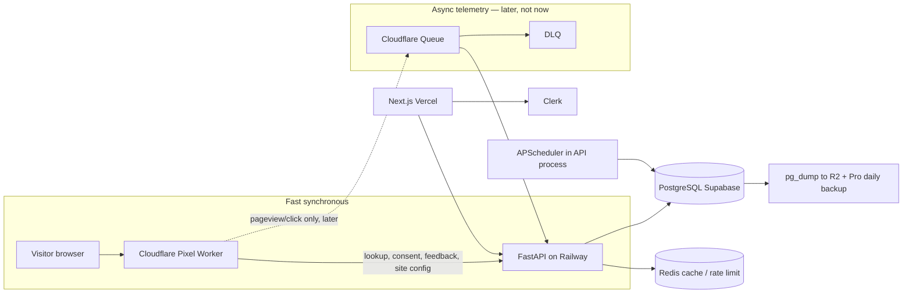

# getBeam production architecture verdict

**Timestamp:** 2026-08-17 23:35 ICT  
**Mode:** independent re-evaluation. Old report `plans/reports/research-260817-2246-db-infra-autoscale-report.md` treated as hypothesis only.

**TL;DR:** Nâng Supabase Pro tuần này, không migrate database, không làm Cloudflare Queue lúc này. Bottleneck thật là disk Free 424/500 MB và aggregation full-history (flag incremental đang OFF), không phải CPU hay throughput.

---

## Evidence classes

- **Fact:** live MCP SQL/project, repo file:line, official vendor docs fetched 2026-08-17.
- **Inference:** conclusion from facts.
- **Assumption:** Railway billing plan (Hobby vs Pro) still not exposed by MCP.

---

## Live production snapshot (MCP 2026-08-17)

Project `retarget-agent` `hylcleqxlkdblibpdhhm`, region `ap-southeast-1`, status `ACTIVE_HEALTHY`, Postgres **17.6**, `max_connections=60`.

| Metric | Value |
|---|---|
| Database size | 444,091,539 bytes (**424 MB**) |
| Alembic head | `b7e3c9a4f215` |
| events | 197,557 |
| events 7d | 22,435 (~3,205/day) |
| Jun / Jul / Aug 1–17 | 25,629 / 96,674 / 75,256 |
| event range | 2026-06-07 → 2026-08-17 |
| `event_id` NULL | **682** |
| ip_org_prefixes | 969,076 rows, 255 MB, GiST `inet_ops` |
| rpki_roas | 0 |
| request_logs | 909 rows, 20 MB |
| sites / users / visitors / identified | 25 / 41 / 2,316 / 107 |
| public tables / RLS off | 56 / 56 |

Org projects: 2 ACTIVE (`retarget-agent`, `buildtolaunch`), 2 INACTIVE (`supabase-fuchsia-book`, `autogtm`). MCP did not return billing plan. **Inference:** still Free — 2/2 active slots + 424 MB against 500 MB cap.

**Fact vs old report:** `pg_class.reltuples` estimated events at 185,062; exact count is 197,557. Timestamp column is `created_at`, **not** `occurred_at`.

---

## 1. Verdict

### Now (this week)

**Supabase Pro + keep Railway FastAPI + Vercel + Cloudflare Pixel + Clerk.**

Why:

1. Disk will hit Free read-only in roughly **4–6 weeks** at ~14 MB/week event growth, sooner if `request_logs` or a bad tenant spikes. Official Free cap is 500 MB then read-only ([database-size](https://supabase.com/docs/guides/platform/database-size), [pricing](https://supabase.com/pricing)).
2. Zero schema/engine migration. GiST `inet` and session advisory locks keep working on session pooler `:5432` / direct.
3. Paid disks autoscale at 90% by +50% ([database-size](https://supabase.com/docs/guides/platform/database-size)).
4. Daily backups 7 days included. PITR is a **separate $100/7-day add-on**, not included ([pricing](https://supabase.com/pricing)).
5. Blog Storage bucket stays.

**Pause `buildtolaunch` before or at upgrade.** Official org billing: Pro org + 2 Micro = `$25 + $10 + $10 − $10 credits = $35` ([pricing](https://supabase.com/pricing)). One project → **~$25**.

Do **not** migrate to Railway PG / DO / Render / Neon this week. Migration cost and lock/session risk exceed the disk emergency.

### At 100,000 events/day

Same vendors. Turn on `aggregation_incremental_enabled`. Enable `site_ingest_limit_enabled` after IP keying is proven. Split **scheduler/worker process** (same image) when ingest p95 or deploy overlap needs a second API replica. Still no ClickHouse. Queue still optional.

Disk math (Inference, 0.63 KB/row from 124 MB / 197k events): 100k/day × 90d ≈ **5.7 GB events** + 255 MB ip-org. Fits Supabase Pro 8 GB included, then cheap overage.

### At 1,000,000 events/day

Still Postgres SoR. Partition `events` by month on `created_at`. Archive raw events >90d to R2. Separate worker process required. Queue useful as burst buffer. Compute likely Small/Medium ($15–$60), not a vendor rewrite. HA/read-replica only after measured CPU/IO, not by calendar.

---

## 2. Architecture diagram

Current production has **no Queue**. Pixel → FastAPI → Postgres is one synchronous ingest path returning 204. Aggregation runs as in-process background task.

---

## 3. Bottleneck ranking

| Pri | Bottleneck | Evidence | Urgency |
|---|---|---|---|
| **P0** | Free disk 424/500 MB, no automatic backup | MCP 424 MB; Free 500 MB + no backups ([pricing](https://supabase.com/pricing)) | This week |
| **P0** | Full-history aggregation on ingest (flag OFF) | `aggregation_incremental_enabled=False` (`config.py:127`); `visitor_aggregator.py:454-458`; ingest `_background_aggregate` (`events.py:906-952`) | Before first real customer spike |
| **P1** | `statement_timeout` coded but **0 = disabled** | `config.py:66`; `database.py:45-46`. Comment says must wait for bounded aggregation | After incremental ON |
| **P1** | Per-site ingest ceiling coded but **OFF** | `site_ingest_limit_enabled=False` (`config.py:293`) | After IP keying proven |
| **P1** | `event_id` unique is **global**, 682 NULLs bypass it | `uq_events_event_id` on `event_id` only; 682 NULLs | Before pixel retries at scale |
| **P1** | No independent backup / restore drill | Free has no automatic backups | Same week as Pro upgrade |
| **P1** | Keep-warm GitHub `*/30` is redundant if API never sleeps | Live 24h API memory never hit 0 (0.176–0.183 GB). Workflow still exists | Can delete after confirming plan; leftover `pr-64` still bills |
| **P2** | `trusted_proxy_hops=0` + diagnostic still in ingest | `config.py:264`; `events.py:259-295`. Mitigated if `ingest_trust_cf_connecting_ip=True` (`config.py:274`) | Measure key_hash cardinality |
| **P2** | Scheduler inside API | `jobs/scheduler.py`; `railway.json` one service | When 2nd replica needed |
| **P2** | Chromium in API image | `Dockerfile:12`; used by `twitter_browser`, `sync.py` | After proving request-path unused |
| **P2** | `request_logs` ~22 KB/row | 20 MB / 909 rows; retention already 7d (`config.py:1237`) | Watch disk |
| **P2** | RLS off on 56 public tables | MCP advisors ERROR; API uses `DATABASE_URL` not anon key | Revoke Data API / anon, do **not** enable RLS en masse |
| **P2** | `migrations/env.py` has no localhost/prod guard | `apps/api/migrations/env.py` uses `settings.database_url` only | Before next local migrate |
| **P2** | ip-org lookup has **no Redis IP cache** | `ip_org_lookup.py:59-69` hits Postgres every call when flag ON | After lookup enabled in prod |
| **P2** | Anonymous visitors not purged | `retention.py` deletes **only raw events** | When visitor table grows |

### Claims in the brief that are **false or partial**

| Claim | Verdict |
|---|---|
| Missing Redis connect/read timeout | **FALSE.** `redis_client.py` sets `socket_connect_timeout=5`, `socket_timeout=5`. Tests in `test_redis_socket_timeout.py`. |
| Missing statement_timeout | **PARTIAL.** Implemented, default 0. |
| Celery `.delay()` silent-drop on ingest | **PARTIAL.** Ingest `.delay()` is behind `job_change_detection_enabled` default False (`events.py:496-500`). CRM/ads gate on `celery_worker_enabled`. Beat banned (`celery_app.py:41`). |
| No ingest payload limit | **FALSE.** `ingest_body_max_bytes=262144` + ASGI middleware (`config.py:233`, `main.py:265+`). |
| No event idempotency | **PARTIAL.** `ON CONFLICT DO NOTHING` on `event_id` (`events.py:470`). Global unique, not `(site_id, event_id)`. NULLs not protected. |
| No `(site_id, created_at)` index | **FALSE.** `ix_events_site_created` exists. |
| Connection cap ~15 | **STALE.** Live `max_connections=60`. Official Nano/Micro = 60 DB connections, 200 pooler clients ([compute-and-disk](https://supabase.com/docs/guides/platform/compute-and-disk)). Code comment still says 15. |
| Redis timeout missing | See above. Rate limiter path uses `socket_connect_timeout=2` (`rate_limiter.py:26`). |

---

## 4. Provider comparison

| | Supabase Pro | Railway PG | DO Managed PG | Render PG | Neon Launch |
|---|---|---|---|---|---|
| PG + GiST `inet` | Fact: already running PG 17.6 | Fact: PG | Fact: PG | Fact: PG | Fact: PG |
| Session advisory lock | Session pooler `:5432` or direct. **Not** `:6543` | Direct on PG service | Session-mode pool documented for advisory locks ([DO pools](https://docs.digitalocean.com/products/databases/postgresql/how-to/manage-connection-pools/)) | Direct OK; transaction PgBouncer not for locks | Direct only; pooled = transaction mode |
| Always-on | Pro never pauses ([pricing](https://supabase.com/pricing)) | Always-on if service running | Always-on | Always-on paid | Scale-to-zero default 5 min; **can disable on Launch** ([plans](https://neon.com/docs/introduction/plans)) |
| Singapore | Fact: `ap-southeast-1` | Fact: API custom domain `api.getbeam.fyi`; Redis private `redis.railway.internal`. Region ID not in MCP | Fact: SGP1, region-agnostic price | Fact: Singapore region exists | Fact: `aws-ap-southeast-1` |
| Disk scaling | Autoscale 90% → +50%, max +200 GB/op, 4×/24h ([database-size](https://supabase.com/docs/guides/platform/database-size)) | Live resize; Hobby cap **5 GB**; Pro default 50 GB, self-serve to 1 TB ([volumes](https://docs.railway.com/volumes/reference)) | 10–30 GiB on 1 GiB plan, **$0.215/GiB**, not the same autoscale | Autoscale 90% → +50%, cannot shrink; **$0.30/GB** ([docs](https://render.com/docs/postgresql-creating-connecting)) | Bill per GB, no 500 MB cliff |
| Backup | Daily 7d included | Manual/automated volume backups | Daily + PITR 7d ([limits](https://docs.digitalocean.com/products/databases/postgresql/details/limits/)) | PITR included paid: Hobby 3d, Pro 7d ([backups](https://render.com/docs/postgresql-backups)) | Instant restore **$0.20/GB-month**; history 7d Launch |
| PITR | **Not** included; **$100/7 days** | Optional pgBackRest; billed as bucket + egress ([PITR](https://docs.railway.com/volumes/point-in-time-recovery)) | Included, 7d window | Included on paid | Paid add-on |
| HA | Not default on Micro | No HA in docs reviewed | Extra standby ≈ 2× | Pro+ | Not the Launch value prop |
| Est. monthly (DB only) | **$25** one Micro; **$35** if `buildtolaunch` stays active | Floor $5 Hobby / $20 Pro **plus** API RAM/CPU. Volume $0.15/GB. **Range, not a point** — Railway plan unverified | **$15.15** 1 GiB / 10 GiB ([DO pricing](https://www.digitalocean.com/pricing/managed-databases)) | **$19 + $0.30×GB** (~$19–22 at 1–8 GB) | Always-on 0.25 CU: `0.25×730×$0.106 ≈ $19.3` + `$0.35/GB` storage ≈ **$20** before restore |
| Ops burden | Low (current vendor) | Solo-founder is DBA for PG+Redis | Low-medium; you own Storage elsewhere | Low if also moving API | Low, but migrate + Storage move |
| Migration | None | Dump/restore + cutover | Dump/restore + TLS from Railway | Dump/restore + maybe move API | Dump/restore; lose blog Storage |
| Failure domain | API Railway ≠ DB Supabase (good isolation) | API+DB+Redis same vendor | API Railway, DB DO, extra egress | Can colocate API+DB Singapore | API Railway, DB Neon |
| **Verdict** | **Choose now** | Cheap disk, weak managed story, Hobby 5 GB too small | **Best cheap managed PG if leaving Supabase** — not worth it this week | PITR nicer; storage expensive; migrate API too | Solves **compute** autoscale; getBeam is burning **disk** |

### Also evaluated

- **Crunchy Bridge:** Singapore exists (`ap-southeast-1`). Hobby-0/1 **$9/$18**, docs: **not intended for production, no SLA** ([plans](https://docs.crunchybridge.com/concepts/plans-pricing)). Standard-4 **$70**. **Reject** for solo-founder now.
- **RDS / Cloud SQL / Azure PG:** Singapore exists; bill + IAM + networking dominate. No cost win vs $25 Pro at this size. **Reject.**
- **Self-hosted (Railway template / VPS):** hidden cost is backup, PITR, vacuum, disk, failover, patching, restore drills. **Reject** while solo.

---

## 5. Queue verdict

**Do not deploy Cloudflare Queue now.**

Why (Fact + Inference):

- Current ~0.04 events/s average, 22k/7d. Official queue throughput 5,000 msg/s ([limits](https://developers.cloudflare.com/queues/platform/limits/)). Throughput is not the constraint.
- Reliability gap is Railway cold start / DB maintenance. Queue helps that, but adds eventual consistency, DLQ ops, and a new consumer. Idempotency must exist **first** (already partial).
- Workers Paid is **$5/month** min; 1M ops included; 3 ops/message typical ([Workers pricing](https://developers.cloudflare.com/workers/platform/pricing/)). Free Queues exist (10k ops/day, 24h retention) as of 2026-02-04 — 3,300×3 ≈ 9,900 ops/day, **too tight**.

| Traffic | Messages/month | Ops ≈ ×3 | Queue $ above $5 Paid |
|---|---|---|---|
| 3,300/day | ~99k | ~0.30M | **$0** (inside 1M) |
| 10,000/day | ~300k | ~0.90M | **$0** |
| 100,000/day | ~3.0M | ~9.0M | **~$3.20** |
| 1,000,000/day | ~30M | ~90M | **~$35.60** |

**When to add Queue:** ingest error rate during deploys/DB maintenance, or p95 ingest > 500 ms, or burst > ~50 rps with PG commit saturation. Not at customer #1 by default.

**If added later:**

- **Queue:** pageview, click, session activity, raw metadata, aggregation input.
- **Stay synchronous:** visitor lookup, identity/offer, consent, feedback, site config, anything that must set `_rta_svid` cookie.
- **Consumer:** **push Worker consumer** to `POST /internal/ingest/batch` (same FastAPI monolith). Pull HTTP consumer is for backpressure control; only if API cannot keep up.
- **Idempotency:** unique `(site_id, event_id)` + `ON CONFLICT DO NOTHING`; ack **after** commit. CF Queues are at-least-once; duplicates are expected.
- **DLQ:** supported; without it, retries exhaust then **delete** ([DLQ](https://developers.cloudflare.com/queues/configuration/dead-letter-queues/)). Max batch 100 ([limits](https://developers.cloudflare.com/queues/platform/limits/)).
- **Fail-open vs closed:** Worker enqueue fail → fallback HTTP ingest (fail-open telemetry). Lookup/consent stay fail-closed as today.
- **Does Queue hide Railway cold start?** Partially for telemetry. Sync lookup still hits cold API. Keep-warm / paid Railway still required for sync path.

---

## 6. Database design actions (before scale)

Do these; do **not** add indexes blindly. Confirm with `EXPLAIN` on live ingest/agg queries.

**Do now / this month**

1. Upgrade Supabase Pro; pause unused project.
2. Independent `pg_dump` (custom format) to R2/S3. Restore drill once.
3. Turn on `aggregation_incremental_enabled` after a staging soak. Keep hourly full-recompute sweep as repair.
4. Set `db_statement_timeout_ms` (start 30s) **after** incremental is on. Sweep job needs a higher timeout or a separate engine.
5. Tighten `event_id`: reject null on ingest; change unique to `(site_id, event_id)` if client IDs are not globally unique UUIDs. Backfill/delete 682 nulls.
6. Do **not** ingest `rpki_roas` on this disk (0 rows; local ingest was ~755k).
7. Keep payload cap 256 KB; consider 16 KB **per event** later, not instead of the body cap.
8. `request_logs` already 7-day purge — verify the scheduler job is actually running in prod.
9. Data API: revoke `anon`/`authenticated` on public tables or disable PostgREST exposure. **Do not** enable RLS on 56 tables without a dedicated project. Backend uses `DATABASE_URL`.
10. Guard `migrations/env.py` (and ip-org `--apply`) against non-localhost when `APP_ENV=development`.

**Already present (do not re-propose as new work)**

- `ix_events_site_created` `(site_id, created_at)`
- `uq_visitors_site_visitor` `(site_id, visitor_id)`
- GiST on `ip_org_prefixes.prefix`
- Event retention 90d, request_log retention 7d (code)
- Ingest body 256 KB
- Redis timeouts 5s
- Incremental aggregation **code** (flag OFF)

**Not yet — need EXPLAIN first**

- BRIN on `created_at` (btree already exists; BRIN wins at much larger append-only size)
- Extra JSONB indexes
- Monthly `PARTITION` on `events` — trigger ~**5 GB events** or seq scans on time windows, not now
- Redis cache for IP→org — only after `ip_org_lookup_enabled` is ON in prod

**Retention policy (code vs desired)**

| Data | Code today | Desired |
|---|---|---|
| Raw events | 90d purge | Keep 90d |
| Request logs | 7d | Keep 7–14d |
| Anonymous visitors | **kept forever** | 90–180d |
| Identified + aggregates | kept | keep |

---

## 7. Scaling triggers (measurable)

| Trigger | Action |
|---|---|
| Disk ≥ 85% of **current** quota | Expand / autoscale verify / purge |
| Disk ≥ 95% or read-only | Incident: retention + drop non-prod data |
| Ingest p95 > 300 ms for 15 min | Trace aggregation vs PG vs Railway |
| Ingest p95 > 800 ms or error rate > 1% | Enable incremental if OFF; consider Queue |
| Sustained ingest > 20 rps | Second API replica **or** split scheduler first |
| DB CPU > 60% / Disk IO % consumed > 50% for 1h | Supabase Small compute (~$15) |
| Connections > 40 of 60 | Do **not** grow `pool_size` until replicas counted: `replicas×5 + 2 lock sessions + deploy overlap` |
| Queue backlog (if exists) oldest > 60s | Scale consumer / batch size |
| Aggregation sweep duration > 10 min | Incremental + partition later |
| Events > 50k/day for 7d | Site quota ON; worker split planning |
| Events > 200k/day | Partition plan; archive design |
| DB size > 6 GB | Archive events to R2; do not jump to ClickHouse |
| Scheduler job last-success gap > 2× interval | Split worker |

---

## 8. Migration plan

### Day 0–7

1. Pause `buildtolaunch` if unused.
2. Upgrade org to Pro. Confirm spend cap ON. Confirm `retarget-agent` compute Micro (not stuck on Nano billed as Micro).
3. Snapshot: `pg_dump` to R2. Store restore command in runbook.
4. Confirm `DATABASE_URL` is **session :5432 or direct**, not `:6543`.
5. Alert disk 60/75/85%. Confirm retention jobs run.
6. Replace GitHub keep-warm with UptimeRobot **or** confirm Railway Pro never sleeps — then delete workflow.
7. Rollback: stay on Pro; cannot roll disk down. Billing rollback = downgrade later after dump.

### Week 2–4

1. UAT `beam-uat`: separate Railway service + separate Supabase project (Pro second project = +$10 compute after credits used). Or Neon Launch always-on 0.25 CU for UAT only (~$20) to avoid second prod-shaped spend — **Assumption**, choose after Railway plan known.
2. Soak `aggregation_incremental_enabled` on UAT then prod.
3. Enable `db_statement_timeout_ms`.
4. Fix `event_id` nulls + unique key.
5. Observe `ingest_client_key` cardinality; then set `trusted_proxy_hops` if CF header is insufficient.
6. Then `site_ingest_limit_enabled` from observed p99, not 3000 placeholder.

### First paying customer

- Quota events/day per plan/site ON.
- Rate limit `site_id + IP` after hop count known.
- Domain allowlist already should be on for pixel.
- No AI/enrichment on every anonymous event (keep flags OFF except qualified).
- Independent backup + restore drill completed.
- Feature flags stay OFF for auto-send.

### Second API replica

Only when a trigger in §7 fires. Then:

- Same image, two Railway processes: `web` (uvicorn, no scheduler) and `worker` (APScheduler only).
- Pool math: `2×5 + 2 lock = 12`, plus deploy overlap 22, still < 60.
- Do **not** enable Celery Beat. Celery worker only if `.delay()` surfaces are ON and a broker consumer exists.
- Rollback: scale replica to 1; scheduler flag must run on exactly one process (advisory locks already single-flight).

---

## Railway live snapshot (MCP 2026-08-18)

Auth: `whoami` as `tranthai.work@gmail.com`. Workspace personal `julleycode's Projects`. Project `retarget-agent` (`d6ab9c4e-8fd5-4066-8fec-34fb4788becd`).

Environments: `production`, `pr-64`.

### Production services

| Service | Status | Replicas / deploys | Notes |
|---|---|---|---|
| `retarget-agent` | SUCCESS | **1** (latest 2026-08-15 `d57fe89`) | Custom domain `api.getbeam.fyi` ACTIVE. Railway domain `retarget-agent-production.up.railway.app`. Private DNS `retarget-agent.railway.internal`. Builder reported RAILPACK (repo `railway.json` still says DOCKERFILE). **99 env vars.** Sleep flag **not** set (unlike `function-bun`). |
| Redis | SUCCESS | 1 (since 2026-06-09) | Image `redis:8.2.1`. Volume + `--save 60 1`. Private `redis.railway.internal:6379`. |
| `function-bun` | **SLEEPING** | 1 | Hello-world leftover. `Sleep when inactive: true`. 24h memory **0**. |
| Postgres (Railway) | **not running in production** | — | 24h CPU/RAM/disk all **0** on production env. Service still listed on the project. |

### Production 24h metrics (Fact)

| Service | CPU avg | RAM | Disk |
|---|---|---|---|
| API | 0.0047 (~0.5%) | **0.18 GB** stable (min 0.176, max 0.183, never 0) | 0 (no volume) |
| Redis | 0.0019 | 0.012 GB | **0.083 GB** volume |
| function-bun | 0 | 0 | — |
| Railway Postgres (prod) | 0 | 0 | 0 |

**Inference:** API did **not** cold-start or sleep in the last 24 hours. Chromium is in the image but **not resident** (~180 MB RSS is uvicorn-scale, not a headed browser). Keep-warm GitHub is likely redundant for sleep, still useful as an uptime ping.

HTTP sample (only 5 requests in the log window): p50 204 ms, p95 286 ms; 2xx=2, 4xx=3, 5xx=0. **Too small for ingest p95.** Do not treat as production latency SLO.

### Connection strategy (Fact, redacted)

- `DATABASE_URL` → Supabase **session pooler** host `aws-1-ap-southeast-1.pooler.supabase.com` **port 5432** (not `:6543`). Advisory locks OK.
- `REDIS_URL` → Railway private Redis.
- `CELERY_BROKER_URL` / `CLICKHOUSE_HOST` → **localhost** (unused in prod).
- `APP_ENV=production`. `API_BASE_URL=https://api.getbeam.fyi`.
- Flags **not** set in Railway (code defaults apply): `aggregation_incremental_enabled`, `celery_worker_enabled`, `site_ingest_limit_enabled`, `db_statement_timeout_ms`, `trusted_proxy_hops`.
- Flags **ON** in Railway (overrides “mostly OFF” product stance): `AGENT_DETECTION_ENABLED`, `AGENT_GATEWAY_ENABLED`, `COMPANY_GRAPH_ENABLED`, `ENABLE_OSINT_SCAN`, `LOCATION_REVEAL_ENABLED`, `REFERRALS_ENABLED`, `REQUEST_LOG_ENABLED`.
- Still OFF: `LEADPIPE_ENABLED`, `PDL_IP_ENABLED`, `REENGAGEMENT_ENABLED`, `MOCK_EXTERNAL_APIS`.

### `pr-64` leftover (Fact)

Still running: API ~0.15 GB RAM, Postgres ~0.06 GB RAM + **0.124 GB disk**, Redis present. Duplicate stack since mid-June. **Billable waste** until removed.

### Plan Hobby vs Pro

MCP has **no billing/plan field**. Still unknown. Usage math at published rates: API RAM ~$1.80/mo + tiny CPU + Redis volume ~$0.01. Fits Hobby $5 included usage **if** the account is Hobby; Pro $20 floor if Pro. Chromium does **not** dominate the bill.

---

## 9. Risks and unknowns

| Unknown | Status after Railway MCP |
|---|---|
| Railway Hobby vs Pro | **Still unknown** — no billing tool. Dashboard only. |
| API replica count | **Resolved: 1** |
| Redis | **Resolved:** Railway plugin, volume, private network, persistence on |
| `DATABASE_URL` port | **Resolved:** session pooler `:5432` |
| Prod incremental / timeout / site ceiling / hops | **Resolved:** unset → code defaults (incremental OFF, timeout 0, ceiling OFF, hops 0) |
| Pixel → `api.getbeam.fyi` | **Likely yes** — custom domain ACTIVE. Worker route not re-read this pass |
| Chromium on request path | **Inference: no** — 180 MB RSS 24h |
| Keep-warm needed for sleep | **Inference: no** for last 24h; still an uptime probe |
| `pr-64` still needed | Unknown intent; it is **running and costing** |
| `buildtolaunch` | Unchanged |
| Data API exposure | Unchanged |
| Event growth | Unchanged |

---

## 10. Final recommendation

**Giữ Supabase, nâng Pro (~$25 nếu pause project thừa, $35 nếu giữ hai project). Không migrate. Không thêm Cloudflare Queue bây giờ. Tách worker khi ingest p95 hoặc replica thứ hai xuất hiện, không theo lịch. Phương án dự phòng: DigitalOcean Managed PostgreSQL Singapore $15.15 nếu phải rời Supabase — rẻ hơn Render/Neon cho always-on disk, nhưng mất Storage và phải dump/restore.**

---

## Load model (Inference from 0.63 KB/event)

| Scenario | Events/month | 90d raw disk | Queue extra | PG compute | Worker split | Partition/archive |
|---|---|---|---|---|---|---|
| Now 3.3k/day | ~99k | ~0.19 GB | no | Nano/Micro | no | no |
| 10k/day | ~300k | ~0.57 GB | no | Micro | no | no |
| 100k/day | ~3.0M | ~5.7 GB | optional | Micro–Small | likely | plan partition |
| 1M/day | ~30M | ~57 GB | yes | Medium+ | yes | partition + R2 archive |

Working set: ip-org 255 MB stays hot for lookup; events recent 7d (~14 MB) + visitors. Connection pressure stays replica-driven, not event-count-driven, until aggregation scans.

---

## Redis

Production **is** Railway Redis (`redis:8.2.1`, private network, volume ~83 MB, AOF/RDB `--save 60 1`). Still cache/rate-limit, not SoR. Timeouts exist in app code. Fail-open on aggregation debounce (`events.py:944`). Persistence is on but not required for TTL keys — acceptable, small disk.

---

## Backup / observability (required)

- Pro daily 7d + independent R2 dump. PITR $100 later, not now.
- RPO: 24h (daily backup) until dump cron 6–12h. RTO: 2–4h dump restore (Assumption until drill).
- Metrics: disk 60/75/85, connections, ingest p50/p95/p99, events/day/site, 429 rate, scheduler last-success, anonymous→identified.
- Correlate `request_id`, `event_id`, `site_id`, `visitor_id`. JSON logs. No secrets.

---

## Cost envelope (not DB-only)

| Item | Now |
|---|---|
| Supabase Pro | $25 (1 project) or $35 (2) |
| Railway production API | Fact usage ~0.18 GB RAM + ~0.5% CPU → about **$2/mo** at list rates, **plus** plan floor |
| Railway Redis | ~0.01 GB RAM + 0.083 GB volume → cents |
| Railway `pr-64` leftover | API ~0.15 GB + PG 0.06 GB RAM + 0.12 GB disk — **delete if unused** |
| Railway `function-bun` | sleeping, ~$0 |
| Plan floor | **Unknown:** Hobby $5 or Pro $20. MCP cannot read plan. Realistic Railway total **$5–25** after deleting `pr-64`, not $20–80 |
| Vercel / Clerk / CF Worker | existing |
| Queue | $0 until added |
| UAT second PG | +$10 Supabase or ~$20 Neon |
| Independent backup R2 | cents–few $ |

---

## Old report — what survives

Keep: FastAPI monolith, Postgres SoR, Vercel, CF Pixel, Clerk, no ClickHouse, no Celery Beat, no volume-on-API, no scale-to-zero, no transaction pooler for lock flows, Pro over Neon for this week.

Challenge: $25 ignores second active project; 15-connection cap is stale (60 live); several “missing” hardening items already exist as flags/code; Queue was out of scope and is correctly **deferred**, not rejected forever.
